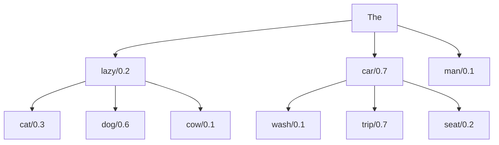

- Beam search is a middle ground between greedy search and searching the full tree
- Greedy search outputs: `The, car, trip`
- Beam search keeps track of `k` most probable candidates at every step
- Assuming `k=2` (usually `k=5`), beam search maintains 2 sequences (beams)
	- `The, car, trip`
	- `The, lazy, dog`

- For below example, assume `k=3`![[Beam_Srch_Imp_1.png]]
- Here, `and, who, who` of beams `1,1,2` score as the most probable, and so we pick them
- We end up with below output ![[Beam_Srch_Imp_2.png]]
- Note that beam `3` of the previous step is discarded after this stage

## References
1. **Efficient NLP**: *How is Beam Search Really Implemented?*: https://youtu.be/tOhWpF5-_z4?si=83b5IqiUz9rCXHN9